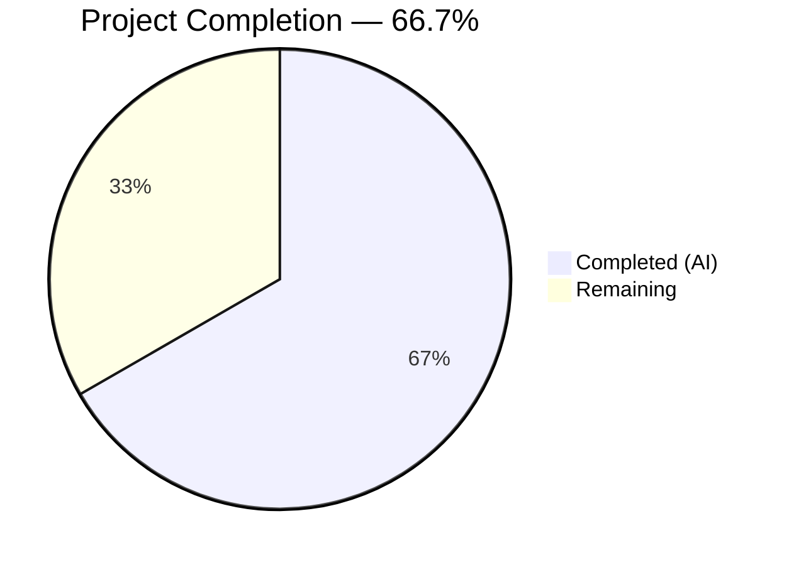
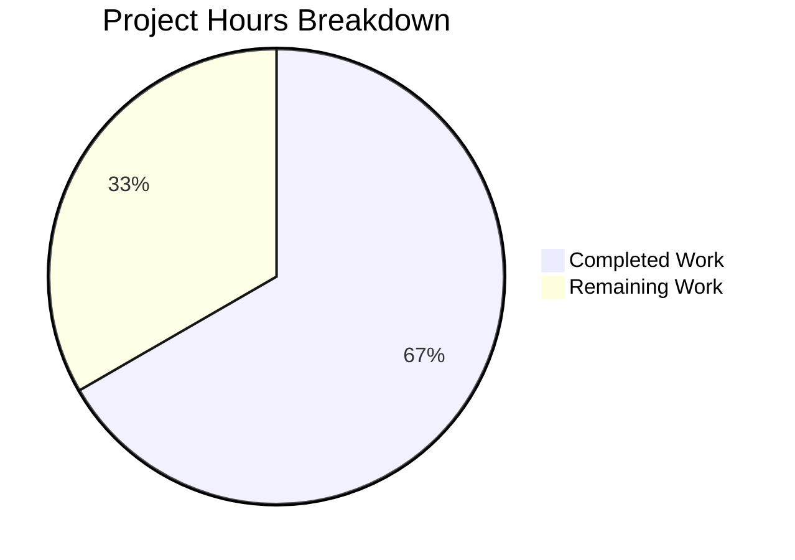

# Blitzy Project Guide

---

## 1. Executive Summary

### 1.1 Project Overview

This project migrates a minimal Node.js HTTP server from the bare `http` module to Express.js 5.2.1, the widely-adopted minimalist web framework for Node.js. The server preserves its original `GET /` endpoint returning `Hello, World!\n` and adds a new `GET /evening` endpoint returning `Good evening`. The target users are developers and integration consumers of the `hello_world` Node.js service. All four repository files (`server.js`, `package.json`, `package-lock.json`, `README.md`) were modified to deliver a complete, runtime-verified Express.js integration.

### 1.2 Completion Status



| Metric | Value |
|--------|-------|
| **Total Project Hours** | 6 |
| **Completed Hours (AI)** | 4 |
| **Remaining Hours** | 2 |
| **Completion Percentage** | 66.7% |

**Calculation:** 4 completed hours / (4 completed + 2 remaining) = 4/6 = 66.7%

### 1.3 Key Accomplishments

- ✅ Replaced bare `http.createServer()` with Express.js 5.2.1 application pattern
- ✅ Preserved `GET /` endpoint returning `Hello, World!\n` with exact response fidelity (including trailing newline)
- ✅ Added `GET /evening` endpoint returning `Good evening` as plain text
- ✅ Updated `package.json` with `express@^5.2.1` dependency, corrected `main` to `server.js`, added `start` script
- ✅ Regenerated `package-lock.json` — 66 packages, 0 vulnerabilities
- ✅ Comprehensive `README.md` documentation with prerequisites, setup instructions, and endpoint reference
- ✅ Runtime validation confirmed both endpoints respond correctly with `200 OK` and `text/plain` content type
- ✅ CommonJS module convention maintained (`require('express')`)
- ✅ Server binding preserved at `127.0.0.1:3000`

### 1.4 Critical Unresolved Issues

| Issue | Impact | Owner | ETA |
|-------|--------|-------|-----|
| No automated test suite | Cannot run regression tests; relies on manual verification | Human Developer | 1h |
| Hardcoded host/port | Server binds to `127.0.0.1:3000` only; not configurable for production environments | Human Developer | 0.5h |

### 1.5 Access Issues

No access issues identified. The project uses only the public npm registry for dependency installation and requires no external service credentials, API keys, or restricted repository access.

### 1.6 Recommended Next Steps

1. **[High]** Review and merge this PR after inspecting the 4 modified files
2. **[Medium]** Configure environment-based `PORT` and `HOST` variables for production deployment flexibility
3. **[Medium]** Add basic test coverage using a lightweight framework (e.g., Jest or Vitest) to validate both endpoints
4. **[Low]** Consider adding Express error-handling middleware for production robustness
5. **[Low]** Set up a CI/CD pipeline for automated testing on future PRs

---

## 2. Project Hours Breakdown

### 2.1 Completed Work Detail

| Component | Hours | Description |
|-----------|-------|-------------|
| Express.js Integration (server.js) | 1.5 | Refactored `server.js` from `http.createServer()` to `express()` with `app.get()` route handlers and `app.listen()` binding; includes Content-Type `text/plain` preservation fix |
| Hello World Endpoint Preservation | 0.5 | Verified `GET /` returns exact `Hello, World!\n` body with trailing newline and `text/plain` content type |
| Good Evening Endpoint | 0.5 | Created `app.get('/evening')` route returning `Good evening` with `text/plain` content type |
| Dependency & Configuration Management | 0.5 | Added `express@^5.2.1` to `package.json` dependencies, corrected `main` field from `index.js` to `server.js`, added `start` script, regenerated `package-lock.json` |
| Documentation (README.md) | 0.5 | Rewrote README with prerequisites, installation, startup instructions, and endpoint reference table |
| Validation & Runtime Verification | 0.5 | Syntax checking, `npm audit`, runtime startup, curl verification of both endpoints and 404 handling |
| **Total Completed** | **4** | |

### 2.2 Remaining Work Detail

| Category | Hours | Priority |
|----------|-------|----------|
| Code review and PR merge | 0.5 | Medium |
| Production environment configuration (env-based PORT/HOST) | 0.5 | Medium |
| Basic test suite creation (endpoint verification tests) | 1 | Low |
| **Total Remaining** | **2** | |

### 2.3 Hours Verification

- Section 2.1 Total: **4 hours**
- Section 2.2 Total: **2 hours**
- Sum (2.1 + 2.2): **6 hours** = Total Project Hours in Section 1.2 ✅

---

## 3. Test Results

| Test Category | Framework | Total Tests | Passed | Failed | Coverage % | Notes |
|---------------|-----------|-------------|--------|--------|------------|-------|
| Unit | N/A | 0 | 0 | 0 | N/A | No test framework exists; placeholder `npm test` script returns exit 1 by design |
| Integration | N/A | 0 | 0 | 0 | N/A | No integration test suite configured |
| Runtime Validation | curl (manual) | 3 | 3 | 0 | N/A | Blitzy agent verified `GET /`, `GET /evening`, and `GET /nonexistent` (404) via curl during validation |

**Notes:**
- The `npm test` script outputs `"Error: no test specified"` and exits with code 1 — this is the default npm placeholder, not an actual test failure
- Test infrastructure was explicitly out of scope per the AAP (Section 0.6.2)
- All runtime validations were performed by Blitzy's autonomous validation agent using `curl` against the live server
- Runtime validation confirmed: `GET /` → 200 `Hello, World!\n`, `GET /evening` → 200 `Good evening`, `GET /nonexistent` → 404

---

## 4. Runtime Validation & UI Verification

### Server Startup
- ✅ `node server.js` starts successfully, outputs `Server running at http://127.0.0.1:3000/`

### Endpoint Verification
- ✅ `GET http://127.0.0.1:3000/` → HTTP 200, Content-Type: `text/plain; charset=utf-8`, Body: `Hello, World!\n`
- ✅ `GET http://127.0.0.1:3000/evening` → HTTP 200, Content-Type: `text/plain; charset=utf-8`, Body: `Good evening`
- ✅ `GET http://127.0.0.1:3000/nonexistent` → HTTP 404, Express default error page (`Cannot GET /nonexistent`)

### Dependency Health
- ✅ `npm install` — 66 packages installed successfully
- ✅ `npm audit` — 0 vulnerabilities found
- ✅ `npm ls` — clean dependency tree, `express@5.2.1` resolved

### Syntax & Compilation
- ✅ `node -c server.js` — syntax check passed with zero errors

### API Response Fidelity
- ✅ `Hello, World!\n` response body preserved with trailing newline character (byte-level compatibility with original)
- ✅ Content-Type set to `text/plain` via `res.type('text')` — matches original `http` module behavior

---

## 5. Compliance & Quality Review

| AAP Requirement | Compliance Status | Evidence |
|----------------|-------------------|----------|
| Integrate Express.js as HTTP framework | ✅ Pass | `server.js` uses `const express = require('express')`, `const app = express()`, `app.listen()` |
| Preserve `GET /` Hello World endpoint | ✅ Pass | Runtime: `GET /` → 200, `Hello, World!\n` |
| Add `GET /evening` Good Evening endpoint | ✅ Pass | Runtime: `GET /evening` → 200, `Good evening` |
| Update `package.json` with express dependency | ✅ Pass | `"express": "^5.2.1"` in dependencies field |
| Correct `main` field in `package.json` | ✅ Pass | Changed from `index.js` to `server.js` |
| Add `start` script to `package.json` | ✅ Pass | `"start": "node server.js"` |
| Regenerate `package-lock.json` | ✅ Pass | 814 lines added, 66 packages locked |
| Update `README.md` documentation | ✅ Pass | Full documentation with endpoints table |
| Use npm as package manager (user rule) | ✅ Pass | All operations used `npm install`, `npm start` |
| CommonJS module convention | ✅ Pass | `require('express')` syntax used |
| Preserve `127.0.0.1:3000` binding | ✅ Pass | `app.listen(3000, '127.0.0.1', ...)` |
| Maintain response body fidelity | ✅ Pass | `Hello, World!\n` with trailing newline verified via curl |
| Zero npm vulnerabilities | ✅ Pass | `npm audit` reports 0 vulnerabilities |
| Node.js v18+ compatibility (Express 5 req.) | ✅ Pass | Runtime: Node.js v20.20.1 |

### Fixes Applied During Validation

| Fix | Commit | Description |
|-----|--------|-------------|
| Content-Type preservation | `5805e4f` | Added `res.type('text')` before `res.send()` to ensure `text/plain` Content-Type matches the original `http` module behavior |

### Outstanding Quality Items

| Item | Status | Notes |
|------|--------|-------|
| No automated test suite | ⚠ Outstanding | Explicitly out of AAP scope; recommended for production readiness |
| No error-handling middleware | ⚠ Outstanding | Express default 404/500 handling in use; custom middleware recommended for production |
| Hardcoded host/port | ⚠ Outstanding | `127.0.0.1:3000` hardcoded; env-based configuration recommended |

---

## 6. Risk Assessment

| Risk | Category | Severity | Probability | Mitigation | Status |
|------|----------|----------|-------------|------------|--------|
| No test suite for regression detection | Technical | Medium | High | Add endpoint tests with Jest or Vitest; test `GET /` and `GET /evening` responses | Open |
| Hardcoded `127.0.0.1:3000` prevents production flexibility | Operational | Low | High | Use `process.env.PORT` and `process.env.HOST` with fallback defaults | Open |
| Express.js 5.x is newly stable | Technical | Low | Low | Pin `express@5.2.1` in `package-lock.json` (already locked); monitor for patch releases | Mitigated |
| No custom error-handling middleware | Operational | Low | Medium | Express defaults return HTML error pages; add JSON error middleware if API consumers expect JSON | Open |
| No rate limiting or security middleware | Security | Low | Low | Add `helmet` and `express-rate-limit` if server becomes publicly accessible | Open |
| No health check endpoint | Operational | Low | Medium | Add `GET /health` returning `200 OK` for load balancer integration | Open |
| No logging infrastructure | Operational | Low | Medium | Add `morgan` or similar request logging middleware for observability | Open |

---

## 7. Visual Project Status



**Integrity Check:** Remaining Work (2h) matches Section 1.2 Remaining Hours (2h) and Section 2.2 Total (2h) ✅

### Remaining Work by Priority

| Priority | Hours | Tasks |
|----------|-------|-------|
| Medium | 1 | Code review + PR merge, Production environment config |
| Low | 1 | Basic test suite creation |
| **Total** | **2** | |

---

## 8. Summary & Recommendations

### Achievement Summary

All Agent Action Plan deliverables have been fully implemented and validated. The project successfully migrated from the bare Node.js `http` module to Express.js 5.2.1 with two route-based endpoints. The `GET /` endpoint preserves the original `Hello, World!\n` response with byte-level fidelity, and the new `GET /evening` endpoint returns `Good evening` as specified. All four repository files were modified, dependency security was verified (0 vulnerabilities), and runtime behavior was confirmed via live endpoint testing.

### Completion Assessment

The project is **66.7% complete** (4 hours completed out of 6 total hours). All AAP-scoped deliverables are fully implemented. The remaining 2 hours consist of path-to-production activities: code review (0.5h), environment configuration (0.5h), and test coverage (1h).

### Critical Path to Production

1. **Code Review** — Human developer reviews the 4 modified files and merges the PR
2. **Environment Configuration** — Replace hardcoded `127.0.0.1:3000` with environment variables for deployment flexibility
3. **Test Coverage** — Add basic endpoint tests to enable automated regression detection

### Production Readiness Assessment

The application is **functionally complete** for its defined scope. It starts cleanly, responds correctly to both endpoints, and uses zero-vulnerability dependencies. However, it is not yet production-hardened: it lacks automated tests, configurable environment binding, and observability tooling. These gaps are proportional to the project's minimal scope and can be addressed in approximately 2 hours of human developer effort.

---

## 9. Development Guide

### System Prerequisites

| Software | Required Version | Verification Command |
|----------|-----------------|---------------------|
| Node.js | v18.0.0 or higher | `node -v` |
| npm | v8.0.0 or higher | `npm -v` |

**Current Environment:** Node.js v20.20.1, npm 11.1.0

### Environment Setup

1. **Clone the repository and checkout the feature branch:**

```bash
git clone <repository-url>
cd <repository-name>
git checkout blitzy-39cf36f0-dbd0-4430-ae88-cb99595cc0a5
```

2. **Install dependencies:**

```bash
npm install
```

Expected output: `added 66 packages` with `0 vulnerabilities`.

3. **Verify dependency tree:**

```bash
npm ls
```

Expected output:
```
hello_world@1.0.0
└── express@5.2.1
```

### Application Startup

**Option A — Using npm start:**

```bash
npm start
```

**Option B — Direct execution:**

```bash
node server.js
```

Expected console output:
```
Server running at http://127.0.0.1:3000/
```

### Verification Steps

1. **Test the Hello World endpoint:**

```bash
curl http://127.0.0.1:3000/
```

Expected response: `Hello, World!` (with trailing newline)

2. **Test the Good Evening endpoint:**

```bash
curl http://127.0.0.1:3000/evening
```

Expected response: `Good evening`

3. **Test 404 handling:**

```bash
curl http://127.0.0.1:3000/nonexistent
```

Expected response: HTML page with `Cannot GET /nonexistent` (HTTP 404)

4. **Verify Content-Type headers:**

```bash
curl -sI http://127.0.0.1:3000/ | grep content-type
```

Expected: `content-type: text/plain; charset=utf-8`

### Stopping the Server

Press `Ctrl+C` in the terminal running the server, or if running in background:

```bash
kill $(lsof -ti:3000)
```

### Troubleshooting

| Issue | Cause | Resolution |
|-------|-------|------------|
| `Error: Cannot find module 'express'` | Dependencies not installed | Run `npm install` |
| `EADDRINUSE: address already in use :::3000` | Port 3000 already occupied | Kill the process on port 3000: `kill $(lsof -ti:3000)` |
| `npm ERR! code ENOENT` | Not in the project root directory | `cd` to the directory containing `package.json` |

---

## 10. Appendices

### A. Command Reference

| Command | Purpose |
|---------|---------|
| `npm install` | Install project dependencies |
| `npm start` | Start the Express.js server |
| `node server.js` | Start the server directly |
| `node -c server.js` | Syntax-check `server.js` without executing |
| `npm audit` | Check dependencies for vulnerabilities |
| `npm ls` | Display installed dependency tree |

### B. Port Reference

| Service | Host | Port | Protocol |
|---------|------|------|----------|
| Express.js HTTP Server | 127.0.0.1 | 3000 | HTTP |

### C. Key File Locations

| File | Purpose |
|------|---------|
| `server.js` | Main application entry point — Express.js server with route handlers |
| `package.json` | npm package manifest with dependencies and scripts |
| `package-lock.json` | Locked dependency tree (66 packages) |
| `README.md` | Project documentation with setup and endpoint reference |

### D. Technology Versions

| Technology | Version | Notes |
|-----------|---------|-------|
| Node.js | v20.20.1 | Runtime environment |
| npm | 11.1.0 | Package manager |
| Express.js | 5.2.1 | HTTP framework (requires Node.js 18+) |

### E. Environment Variable Reference

| Variable | Default | Description | Status |
|----------|---------|-------------|--------|
| `PORT` | 3000 (hardcoded) | Server listening port | Not yet configurable — hardcoded in `server.js` |
| `HOST` | 127.0.0.1 (hardcoded) | Server binding address | Not yet configurable — hardcoded in `server.js` |

**Note:** Environment variable support is listed as a remaining task. Currently, host and port are hardcoded constants in `server.js`.

### F. Developer Tools Guide

| Tool | Command | Purpose |
|------|---------|---------|
| Syntax Check | `node -c server.js` | Validate JavaScript syntax without execution |
| Dependency Audit | `npm audit` | Scan for known vulnerabilities in dependencies |
| Dependency Tree | `npm ls` | Inspect resolved dependency versions |
| Endpoint Testing | `curl http://127.0.0.1:3000/` | Verify server responses |
| Header Inspection | `curl -sI http://127.0.0.1:3000/` | Inspect response headers |

### G. Glossary

| Term | Definition |
|------|-----------|
| Express.js | Minimalist web framework for Node.js providing routing, middleware, and HTTP utilities |
| CommonJS | Module system using `require()` and `module.exports` (default in Node.js) |
| Route Handler | Function bound to a specific HTTP method and URL path in Express.js |
| Transitive Dependency | A dependency of a dependency, automatically resolved by npm |
| package-lock.json | File that locks the exact versions of all installed packages for reproducible builds |