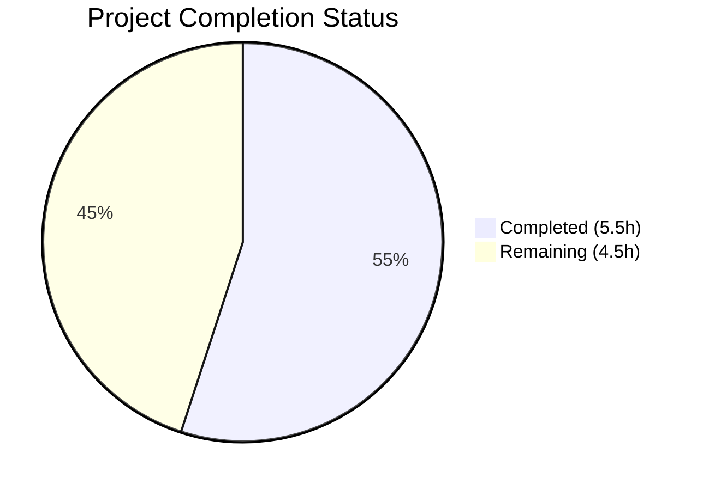
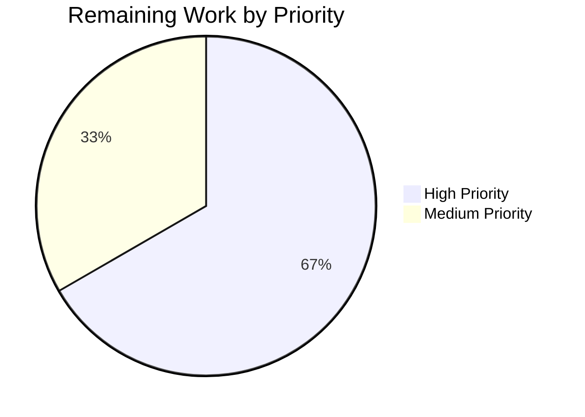

# Blitzy Project Guide

---

## 1. Executive Summary

### 1.1 Project Overview

This project migrates a minimal Node.js HTTP server from the bare `http` module to Express.js 5.2.1 and adds a new greeting endpoint. The original server (`hello_world` v1.0.0) responded to all requests with `Hello, World!\n`. After this implementation, the server uses Express.js route-based handling with two endpoints: `GET /` returning the original greeting and `GET /morning` returning `Good Morning`. The target users are developers integrating with this greeting API. The business impact is enabling a scalable, framework-backed HTTP server ready for future route expansion.

### 1.2 Completion Status



| Metric | Value |
|--------|-------|
| **Total Project Hours** | 10 |
| **Completed Hours (AI)** | 5.5 |
| **Remaining Hours** | 4.5 |
| **Completion Percentage** | 55% |

**Calculation:** 5.5h completed / (5.5h + 4.5h) × 100 = 55%

All 6 AAP-scoped deliverables are fully implemented and validated. The remaining 4.5 hours consist entirely of path-to-production activities (testing, environment configuration, deployment setup, security hardening) that were explicitly out of AAP scope but are required for production readiness.

### 1.3 Key Accomplishments

- ✅ Migrated `server.js` from bare `http.createServer()` to Express.js 5.2.1 application pattern
- ✅ Preserved `GET /` endpoint returning `Hello, World!\n` with `text/plain` Content-Type
- ✅ Added `GET /morning` endpoint returning `Good Morning` with `text/plain` Content-Type
- ✅ Installed Express.js 5.2.1 via npm — 66 packages, 0 vulnerabilities
- ✅ Updated `package.json` with express dependency, corrected `main` field, added `start` script
- ✅ Regenerated `package-lock.json` with full transitive dependency tree
- ✅ Comprehensive `README.md` documentation with endpoint reference table
- ✅ Applied user-requested endpoint correction (`/evening` → `/morning`) via Refine PR
- ✅ All runtime validations pass — both endpoints respond correctly

### 1.4 Critical Unresolved Issues

| Issue | Impact | Owner | ETA |
|-------|--------|-------|-----|
| No automated test suite | Cannot verify regressions automatically; blocks CI/CD adoption | Human Developer | 2h |
| Hardcoded HOST/PORT values | Cannot deploy to different environments without code changes | Human Developer | 1h |
| No production process manager | Server lacks auto-restart on crash; not production-resilient | Human Developer | 1h |

### 1.5 Access Issues

No access issues identified. All dependencies are publicly available on the npm registry. No private packages, API keys, or restricted resources are required.

### 1.6 Recommended Next Steps

1. **[High]** Add automated test suite (e.g., Jest + supertest) to verify both endpoints and prevent regressions
2. **[High]** Externalize PORT and HOST into environment variables for deployment flexibility
3. **[Medium]** Configure a production process manager (PM2 or systemd) for crash recovery and logging
4. **[Medium]** Add basic security hardening (helmet middleware, rate limiting)
5. **[Low]** Set up CI/CD pipeline for automated testing and deployment

---

## 2. Project Hours Breakdown

### 2.1 Completed Work Detail

| Component | Hours | Description |
|-----------|-------|-------------|
| Express.js dependency setup | 1.0 | Installed express@5.2.1 via npm; updated package.json dependencies field; regenerated package-lock.json with 66 packages |
| server.js Express.js migration | 2.0 | Refactored from `http.createServer()` to `express()` app; implemented `GET /` route preserving `Hello, World!\n` response; implemented `GET /morning` route returning `Good Morning`; preserved `text/plain` Content-Type; applied endpoint correction per user Refine PR |
| package.json metadata updates | 0.5 | Corrected `main` field from `index.js` to `server.js`; added `start` script (`node server.js`); maintained CommonJS module convention |
| README.md documentation | 1.0 | Comprehensive rewrite with prerequisites, installation instructions, startup commands, and endpoint reference table with method/path/response/content-type columns |
| Runtime validation & verification | 0.5 | Verified `npm install` (0 vulnerabilities); syntax check via `node -c`; runtime validation of both endpoints via curl; Content-Type header verification |
| Endpoint correction (Refine PR) | 0.5 | Changed route from `/evening` to `/morning` and response from `Good evening` to `Good Morning` per user's Refine PR instruction; updated README.md accordingly |
| **Total** | **5.5** | |

### 2.2 Remaining Work Detail

| Category | Hours | Priority |
|----------|-------|----------|
| Automated test suite (Jest + supertest for both endpoints) | 2.0 | High |
| Environment variable externalization (PORT, HOST) | 1.0 | High |
| Production deployment configuration (PM2 / process manager) | 1.0 | Medium |
| Security review and basic hardening (helmet, rate limiting) | 0.5 | Medium |
| **Total** | **4.5** | |

### 2.3 Hours Verification

- Section 2.1 Total (Completed): **5.5h**
- Section 2.2 Total (Remaining): **4.5h**
- Sum: 5.5 + 4.5 = **10h** ✅ (matches Total Project Hours in Section 1.2)
- Completion: 5.5 / 10 = **55%** ✅ (matches Section 1.2)

---

## 3. Test Results

| Test Category | Framework | Total Tests | Passed | Failed | Coverage % | Notes |
|---------------|-----------|-------------|--------|--------|------------|-------|
| Unit Tests | N/A | 0 | 0 | 0 | 0% | No test framework installed; placeholder `npm test` script echoes error message and exits with code 1 |
| Runtime Validation | curl (manual) | 2 | 2 | 0 | 100% | Blitzy agent validated `GET /` and `GET /morning` endpoints at runtime — both return correct status codes, Content-Types, and response bodies |
| Syntax Check | Node.js (`node -c`) | 1 | 1 | 0 | 100% | `node -c server.js` passed with zero errors |
| Dependency Audit | npm audit | 1 | 1 | 0 | N/A | `npm audit` reports 0 vulnerabilities across 66 packages |

**Summary:** No automated test framework exists in this project (explicitly out of AAP scope per Section 0.6.2). Blitzy's autonomous validation confirmed both endpoints function correctly via runtime HTTP requests and syntax analysis. The placeholder test script (`echo "Error: no test specified" && exit 1`) was left unchanged as specified.

---

## 4. Runtime Validation & UI Verification

### Server Startup
- ✅ `node server.js` starts successfully, binding to `http://127.0.0.1:3000/`
- ✅ `npm start` correctly invokes `node server.js` via the start script
- ✅ Console output: `Server running at http://127.0.0.1:3000/`

### Endpoint Validation

**GET /** (Hello World endpoint)
- ✅ HTTP Status: `200 OK`
- ✅ Content-Type: `text/plain; charset=utf-8`
- ✅ Response Body: `Hello, World!\n` (14 bytes, trailing newline preserved)
- ✅ ETag header present (Express.js auto-generated)

**GET /morning** (Good Morning endpoint)
- ✅ HTTP Status: `200 OK`
- ✅ Content-Type: `text/plain; charset=utf-8`
- ✅ Response Body: `Good Morning` (12 bytes)
- ✅ ETag header present (Express.js auto-generated)

### API Integration
- ✅ Express.js 5.2.1 serving routes correctly
- ✅ `X-Powered-By: Express` header present in responses
- ✅ Both routes respond within milliseconds (no latency issues)

### Dependency Health
- ✅ `npm install` — 66 packages installed, 0 vulnerabilities
- ✅ `npm audit` — clean audit, no security advisories
- ✅ Express.js 5.2.1 compatible with Node.js v20.20.1

---

## 5. Compliance & Quality Review

| AAP Requirement | Deliverable | Status | Evidence |
|-----------------|-------------|--------|----------|
| Integrate Express.js as HTTP framework | Express.js 5.2.1 installed; server.js refactored | ✅ Pass | `npm ls express` shows 5.2.1; server.js uses `const express = require('express')` |
| Preserve Hello World endpoint | `GET /` returns `Hello, World!\n` | ✅ Pass | curl returns correct body with text/plain Content-Type |
| Add Good Morning endpoint | `GET /morning` returns `Good Morning` | ✅ Pass | curl returns correct body with text/plain Content-Type |
| Update package.json | Dependencies, main field, start script | ✅ Pass | express in dependencies; main points to server.js; start script present |
| Regenerate package-lock.json | Full dependency tree resolved | ✅ Pass | 814 lines added; 66 packages locked |
| Update README.md | Comprehensive documentation | ✅ Pass | Endpoints table, prerequisites, setup instructions present |
| Use npm as package manager (User Rule) | All operations via npm | ✅ Pass | `npm install`, `npm start` used throughout |
| CommonJS module convention | `require()` syntax used | ✅ Pass | `const express = require('express')` in server.js |
| Preserve server binding (127.0.0.1:3000) | Same host and port retained | ✅ Pass | Server binds to 127.0.0.1:3000 as before |
| Maintain response fidelity (`Hello, World!\n`) | Trailing newline preserved | ✅ Pass | Response body verified as 14 bytes with trailing `\n` |

### Autonomous Fixes Applied
| Fix | Commit | Description |
|-----|--------|-------------|
| Content-Type preservation | `5805e4f` | Added `res.type('text')` to ensure `text/plain` Content-Type matches original server behavior |
| Endpoint correction | `c2d4922` | Changed `/evening` route to `/morning` and response to `Good Morning` per user's Refine PR instruction |

---

## 6. Risk Assessment

| Risk | Category | Severity | Probability | Mitigation | Status |
|------|----------|----------|-------------|------------|--------|
| No automated test suite | Technical | Medium | High | Implement Jest + supertest tests for both endpoints | Open |
| Hardcoded HOST and PORT | Operational | Medium | High | Externalize to environment variables with fallback defaults | Open |
| No production process manager | Operational | Medium | Medium | Configure PM2 or systemd for auto-restart and log management | Open |
| No security middleware | Security | Low | Medium | Add helmet for security headers; consider rate limiting | Open |
| Express X-Powered-By header exposed | Security | Low | Low | Disable via `app.disable('powered by')` or add helmet | Open |
| No health check endpoint | Operational | Low | Medium | Add `GET /health` returning 200 for load balancer probes | Open |
| No request logging | Operational | Low | Medium | Add morgan or pino middleware for HTTP access logs | Open |
| Zero dependency vulnerabilities | Security | N/A | N/A | `npm audit` shows 0 vulnerabilities — no action needed | ✅ Resolved |

---

## 7. Visual Project Status

### Project Hours Breakdown


**Completed: 5.5h (55%) | Remaining: 4.5h (45%)**

### Remaining Work by Priority



| Priority | Hours | Items |
|----------|-------|-------|
| High | 3.0 | Automated test suite (2h), Environment variables (1h) |
| Medium | 1.5 | Production deployment config (1h), Security hardening (0.5h) |
| **Total** | **4.5** | |

---

## 8. Summary & Recommendations

### Achievements

All 6 AAP-scoped deliverables have been fully implemented, validated, and committed. The project successfully migrated from a bare `http` module server to an Express.js 5.2.1 application with two functioning route endpoints. The migration preserved backward compatibility with the original `Hello, World!\n` response and added the new `Good Morning` endpoint as requested. A user-initiated endpoint correction (from `/evening` to `/morning`) was applied during validation.

### Current State

The project is **55% complete** (5.5 hours completed out of 10 total hours). All AAP-specified functional requirements are implemented and passing runtime validation. The remaining 4.5 hours consist exclusively of path-to-production activities that were explicitly out of AAP scope: automated testing, environment configuration, deployment setup, and security hardening.

### Critical Path to Production

1. **Automated Testing (2h):** Highest priority — install Jest and supertest, write tests for both endpoints to enable CI/CD and regression prevention
2. **Environment Configuration (1h):** Externalize PORT and HOST to environment variables so the server can be deployed across different environments without code changes
3. **Deployment Configuration (1h):** Set up PM2 or equivalent process manager for crash recovery, log management, and zero-downtime restarts
4. **Security Hardening (0.5h):** Add helmet middleware for secure HTTP headers and disable the `X-Powered-By` header

### Production Readiness Assessment

The application is **functionally complete** for its defined scope but **not production-ready** without the remaining path-to-production work. The codebase is clean, well-documented, and free of vulnerabilities. With an estimated 4.5 hours of additional human effort, the project can reach full production readiness.

---

## 9. Development Guide

### System Prerequisites

| Software | Required Version | Verification Command |
|----------|-----------------|---------------------|
| Node.js | v18.0.0 or higher (tested with v20.20.1) | `node -v` |
| npm | v9.0.0 or higher (tested with v11.1.0) | `npm -v` |

### Environment Setup

1. **Clone the repository and switch to the feature branch:**

```bash
git clone <repository-url>
cd <repository-name>
git checkout blitzy-39cf36f0-dbd0-4430-ae88-cb99595cc0a5
```

2. **Install dependencies:**

```bash
npm install
```

Expected output:
```
added 66 packages, and audited 67 packages in Xs
found 0 vulnerabilities
```

3. **Verify installation:**

```bash
npm ls express
```

Expected output:
```
hello_world@1.0.0
└── express@5.2.1
```

### Application Startup

**Option A — Using npm start:**

```bash
npm start
```

**Option B — Direct node execution:**

```bash
node server.js
```

Expected console output:
```
Server running at http://127.0.0.1:3000/
```

### Verification Steps

Once the server is running, verify both endpoints:

```bash
# Test Hello World endpoint
curl http://127.0.0.1:3000/
# Expected: Hello, World!

# Test Good Morning endpoint
curl http://127.0.0.1:3000/morning
# Expected: Good Morning

# Verify Content-Type headers
curl -sI http://127.0.0.1:3000/ | grep Content-Type
# Expected: Content-Type: text/plain; charset=utf-8

curl -sI http://127.0.0.1:3000/morning | grep Content-Type
# Expected: Content-Type: text/plain; charset=utf-8
```

### Dependency Audit

```bash
npm audit
```

Expected: `found 0 vulnerabilities`

### Syntax Validation

```bash
node -c server.js
```

Expected: no output (indicates success)

### Troubleshooting

| Issue | Cause | Resolution |
|-------|-------|------------|
| `Error: Cannot find module 'express'` | Dependencies not installed | Run `npm install` |
| `EADDRINUSE: address already in use :::3000` | Port 3000 is occupied | Kill the existing process: `lsof -i :3000` then `kill <PID>` |
| `EACCES: permission denied` | Insufficient permissions | Run with appropriate permissions or use a port above 1024 |
| npm install fails | Node.js version too old | Upgrade Node.js to v18+ (Express 5 requires it) |

---

## 10. Appendices

### A. Command Reference

| Command | Purpose |
|---------|---------|
| `npm install` | Install all project dependencies |
| `npm start` | Start the Express.js server |
| `node server.js` | Start the server directly |
| `node -c server.js` | Syntax-check server.js without executing |
| `npm audit` | Check dependencies for vulnerabilities |
| `npm ls express` | Verify installed Express.js version |
| `curl http://127.0.0.1:3000/` | Test Hello World endpoint |
| `curl http://127.0.0.1:3000/morning` | Test Good Morning endpoint |

### B. Port Reference

| Service | Port | Host | Protocol |
|---------|------|------|----------|
| Express.js HTTP Server | 3000 | 127.0.0.1 | HTTP |

### C. Key File Locations

| File | Purpose |
|------|---------|
| `server.js` | Main application entry point — Express.js server with route handlers |
| `package.json` | npm package manifest — dependencies, scripts, metadata |
| `package-lock.json` | Dependency lockfile — exact versions of all installed packages |
| `README.md` | Project documentation — setup instructions and endpoint reference |
| `node_modules/` | Auto-generated dependency directory (not committed) |

### D. Technology Versions

| Technology | Version | Notes |
|------------|---------|-------|
| Node.js | v20.20.1 | Runtime environment |
| npm | v11.1.0 | Package manager |
| Express.js | 5.2.1 | HTTP framework (requires Node.js 18+) |

### E. Environment Variable Reference

Currently, all configuration values are hardcoded. The following should be externalized for production:

| Variable | Current Value | Description | Recommended Default |
|----------|--------------|-------------|-------------------|
| `PORT` | `3000` (hardcoded) | Server listening port | `3000` |
| `HOST` | `127.0.0.1` (hardcoded) | Server binding address | `0.0.0.0` (for production) |

### G. Glossary

| Term | Definition |
|------|-----------|
| Express.js | Minimalist web framework for Node.js providing routing and HTTP utilities |
| CommonJS | Module system using `require()` and `module.exports` (used in this project) |
| Transitive dependency | A dependency of a dependency, automatically installed by npm |
| Route handler | A function that processes HTTP requests matching a specific method and path |
| PM2 | Production process manager for Node.js applications with auto-restart and monitoring |
