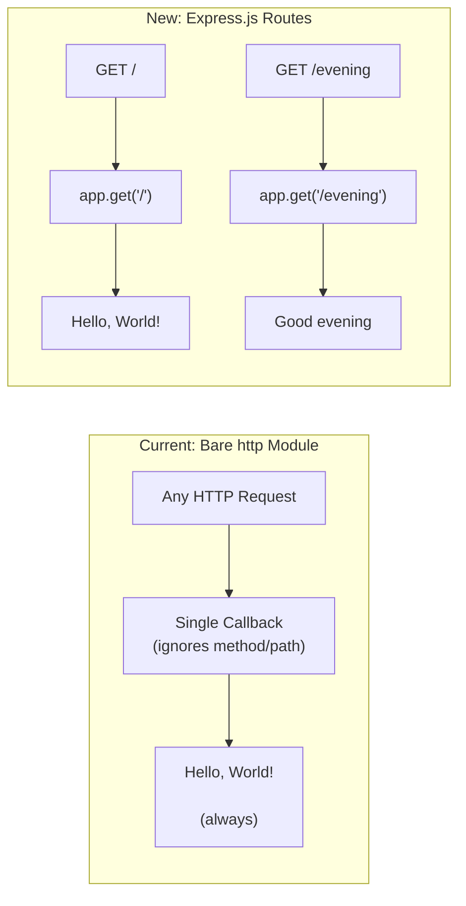

# Technical Specification

# 0. Agent Action Plan

## 0.1 Intent Clarification


### 0.1.1 Core Feature Objective

Based on the prompt, the Blitzy platform understands that the new feature requirement is to:

- **Integrate Express.js as the HTTP framework**: Replace the current bare `http` module server implementation in `server.js` with Express.js, the widely-adopted minimalist web framework for Node.js. The existing project currently uses Node.js's built-in `http.createServer()` with a single callback that ignores all request attributes (method, path, headers) and always returns `Hello, World!\n`. Express.js must be added as a project dependency and used to create the application server with proper route-based request handling.

- **Preserve the existing "Hello World" endpoint**: The current server responds to all requests with the plain-text `Hello, World!\n` body. This behavior must be preserved by binding it to a specific Express.js route (e.g., `GET /`) so that the original functionality remains accessible while coexisting with the new endpoint.

- **Add a new "Good evening" endpoint**: A second Express.js route must be created that returns the plain-text response `Good evening` when accessed. This requires defining a distinct HTTP route path (e.g., `GET /evening`) that returns the new greeting as its response body.

**Implicit requirements detected:**

- The `package.json` must be updated to include `express` as a dependency, and `package-lock.json` will be regenerated to include Express and its transitive dependency tree
- The `server.js` file must be refactored from the bare `http` module pattern to the Express.js application pattern, replacing `http.createServer()` with `express()` and `app.listen()`
- Port `3000` and localhost binding should be preserved for continuity with the existing server configuration
- The `main` field in `package.json` currently points to `index.js` (which does not exist); this is an opportunity to correct the entry point, or it can remain as-is since the server is invoked directly via `node server.js`

### 0.1.2 Special Instructions and Constraints

- **User Rule — "Npm create"**: The user has specified an implementation rule named `30-march-ruls` with the content `Npm create`. This directive indicates that `npm` should be used as the package manager for all dependency installation and project management operations throughout implementation.
- **Maintain server behavior continuity**: The existing `Hello, World!` response must remain accessible after the migration to Express.js, ensuring backward compatibility for any consumers currently hitting the server
- **Follow existing repository conventions**: The project uses CommonJS (`require` syntax) as evidenced by `const http = require('http');` in `server.js`. Express.js integration must use CommonJS imports (`const express = require('express');`) to remain consistent with the existing module system
- **No user-provided examples**: The user did not provide specific code examples or route path preferences; path naming will follow Express.js conventions

### 0.1.3 Technical Interpretation

These feature requirements translate to the following technical implementation strategy:

- To **integrate Express.js**, we will install the `express` npm package (version `5.2.1`, the latest stable release) using `npm install express`, then refactor `server.js` to import Express, create an application instance via `const app = express()`, and replace `http.createServer()` and `server.listen()` with `app.listen()`
- To **preserve the Hello World endpoint**, we will create an Express route `app.get('/')` that responds with `Hello, World!\n` using `res.send()`, maintaining the exact same response body as the current implementation
- To **add the Good evening endpoint**, we will create a new Express route `app.get('/evening')` that responds with `Good evening` as plain text
- To **update project metadata**, we will ensure `package.json` includes `express` in its `dependencies` field, and regenerate `package-lock.json` to reflect the complete dependency tree


## 0.2 Repository Scope Discovery


### 0.2.1 Comprehensive File Analysis

The repository is a flat, four-file Node.js project with zero subdirectories. Every file has been inspected and assessed for impact.

**Existing files requiring modification:**

| File | Status | Purpose of Change |
|------|--------|-------------------|
| `server.js` | MODIFY | Refactor from bare `http` module to Express.js application with route-based endpoints |
| `package.json` | MODIFY | Add `express` to `dependencies`, optionally add a `start` script, and correct metadata |
| `package-lock.json` | REGENERATE | Will be automatically regenerated by `npm install` to include Express.js and its transitive dependencies |
| `README.md` | MODIFY | Update documentation to reflect Express.js integration and new endpoint availability |

**Detailed change analysis per file:**

- **`server.js`** (14 lines) — This is the sole runtime artifact. Currently uses `const http = require('http')` to create a server with `http.createServer()` that responds to all requests with `Hello, World!\n`. The entire file must be refactored to:
  - Replace the `http` module import with `const express = require('express')`
  - Replace `http.createServer()` with `const app = express()`
  - Convert the monolithic request handler into two distinct route handlers: `app.get('/')` for the Hello World response and `app.get('/evening')` for the Good evening response
  - Replace `server.listen()` with `app.listen()`

- **`package.json`** (11 lines) — Currently declares zero dependencies. The `express` package must be added to a new `dependencies` field. Optionally, a `start` script (`"start": "node server.js"`) can be added to `scripts` for convenience. The `main` field currently points to non-existent `index.js` — this may be corrected to `server.js`.

- **`package-lock.json`** (13 lines) — Currently contains only the root package entry with zero installed dependencies. Running `npm install express` will regenerate this file to include Express.js and all of its transitive dependencies (such as `accepts`, `body-parser`, `content-disposition`, `cookie`, `debug`, `path-to-regexp`, `qs`, `send`, `serve-static`, among others).

- **`README.md`** (2 lines) — Currently identifies the project as `hao-backprop-test` with a "Do not touch!" directive. Should be updated to document the Express.js integration and the two available endpoints.

**Integration point discovery:**

- **Route registration**: `server.js` is the single point where HTTP routes are defined; both the existing root endpoint and the new `/evening` endpoint must be registered here
- **Dependency injection**: Express.js application instance (`app`) serves as the central dependency that replaces the `http.createServer()` server instance
- **Port binding**: The `app.listen(3000, hostname)` call in `server.js` is the sole binding point for the TCP listener

**No subdirectories or additional files exist** — there are no test directories, configuration folders, CI/CD workflows, Docker files, or documentation directories to evaluate.

### 0.2.2 Web Search Research Conducted

- **Express.js latest stable version**: Research confirmed Express.js version `5.2.1` as the latest stable release on the npm registry. Express 5 was officially released after years of development, focusing on security improvements, codebase simplification, and dropping support for Node.js versions before v18. The current project runs Node.js v20.20.1, which is fully compatible.
- **Express.js basic routing patterns**: Express.js routes are defined using `app.METHOD(path, handler)` where `METHOD` is an HTTP verb in lowercase (e.g., `get`, `post`) and the handler receives `(req, res)` arguments. Response is sent via `res.send()` for plain text or HTML content.
- **Express.js migration from bare http module**: Converting from `http.createServer()` to Express involves replacing the monolithic request callback with individual route handlers, using Express's built-in routing and response utilities.

### 0.2.3 New File Requirements

**New source files to create:**

No new source files need to be created. The existing `server.js` file will be refactored in-place to incorporate Express.js. The repository's minimal, flat structure is preserved — all runtime logic remains in a single file.

**New generated files:**

| File/Directory | Type | Purpose |
|----------------|------|---------|
| `node_modules/` | Directory (auto-generated) | Created by `npm install`; contains Express.js and its transitive dependencies |
| `node_modules/express/` | Directory (auto-generated) | Express.js framework source code and its nested dependencies |

**No new test files, configuration files, or documentation directories are required** — the scope of this change is confined to modifying existing files and adding the Express.js dependency.


## 0.3 Dependency Inventory


### 0.3.1 Private and Public Packages

The project currently has zero dependencies. This feature addition introduces exactly one direct public dependency.

**Key packages relevant to this feature addition:**

| Package Registry | Package Name | Version | Purpose |
|-----------------|--------------|---------|---------|
| npm (public) | `express` | `5.2.1` | Minimalist web framework for Node.js; provides routing, middleware, and HTTP utility methods to replace the bare `http.createServer()` pattern |

**Version verification:**

- Express.js `5.2.1` is confirmed as the latest stable release on the npm registry (`npmjs.com/package/express`)
- Express 5.x requires Node.js 18 or higher; the project's Node.js v20.20.1 runtime satisfies this requirement
- No version was explicitly specified by the user; version `5.2.1` was selected based on the latest published stable release

**Runtime dependencies (pre-existing):**

| Dependency | Type | Version | Purpose |
|-----------|------|---------|---------|
| Node.js | Runtime | v20.20.1 | JavaScript runtime environment |
| npm | Package Manager | v11.1.0 | Dependency management and script execution |

**Transitive dependencies introduced by Express.js 5.x:**

Express.js brings a set of well-maintained transitive dependencies including but not limited to: `accepts`, `body-parser`, `content-disposition`, `content-type`, `cookie`, `cookie-signature`, `debug`, `encodeurl`, `etag`, `finalhandler`, `fresh`, `merge-descriptors`, `methods`, `mime-types`, `on-finished`, `parseurl`, `path-to-regexp`, `qs`, `range-parser`, `router`, `safe-buffer`, `send`, `serve-static`, `statuses`, `type-is`, `utils-merge`, and `vary`. All of these will be automatically resolved and locked in `package-lock.json` upon installation.

### 0.3.2 Dependency Updates

**Import Updates:**

The following import transformation is required in the sole source file:

| File | Current Import | New Import |
|------|---------------|------------|
| `server.js` | `const http = require('http');` | `const express = require('express');` |

The `http` module import is fully replaced by the `express` import since Express.js internally manages HTTP server creation.

**Package manifest updates:**

| File | Change Type | Details |
|------|------------|---------|
| `package.json` | ADD field | Add `"dependencies": { "express": "^5.2.1" }` |
| `package.json` | MODIFY field (optional) | Add `"start": "node server.js"` to `scripts` |
| `package-lock.json` | REGENERATE | Full regeneration via `npm install` to include Express.js dependency tree |

**No external reference updates required** — the project contains no CI/CD configuration, no Docker files, no build scripts, and no additional configuration files that reference dependencies.


## 0.4 Integration Analysis


### 0.4.1 Existing Code Touchpoints

**Direct modifications required:**

- **`server.js` (lines 1–14)**: The entire file content is affected. The refactoring replaces the bare `http` module pattern with the Express.js application pattern. Specific line-level changes:
  - Line 1: Replace `const http = require('http');` with `const express = require('express');`
  - Lines 3–4: Retain `hostname` and `port` constants (`'127.0.0.1'` and `3000`)
  - Lines 6–10: Replace the `http.createServer()` callback with Express app creation (`const app = express()`) and two route definitions (`app.get('/', ...)` and `app.get('/evening', ...)`)
  - Lines 12–14: Replace `server.listen(port, hostname, ...)` with `app.listen(port, hostname, ...)` preserving the console log callback

- **`package.json` (lines 1–11)**: Add `dependencies` field with Express.js entry. Optionally modify `scripts` to include a `start` command.

- **`package-lock.json` (lines 1–13)**: Entire file will be regenerated by npm to reflect the new dependency tree.

- **`README.md` (lines 1–2)**: Update project description to reflect new endpoint availability and Express.js integration.

**Dependency injection points:**

| Component | Current State | New State |
|-----------|--------------|-----------|
| HTTP Server creation | `http.createServer((req, res) => {...})` | `const app = express()` |
| Request handling | Single monolithic callback ignoring all request attributes | Route-based handlers: `app.get('/')` and `app.get('/evening')` |
| Response mechanism | `res.statusCode = 200; res.setHeader(...); res.end(...)` | `res.send('Hello, World!\n')` and `res.send('Good evening')` |
| Server startup | `server.listen(port, hostname, callback)` | `app.listen(port, hostname, callback)` |

**Data flow changes:**



**No database or schema changes** — the project has no data persistence layer. No middleware, service containers, or configuration injection frameworks are present or required.


## 0.5 Technical Implementation


### 0.5.1 File-by-File Execution Plan

Every file listed below MUST be created or modified as specified.

**Group 1 — Core Feature File:**

| Action | File | Description |
|--------|------|-------------|
| MODIFY | `server.js` | Refactor from bare `http` module to Express.js application; define `GET /` route returning `Hello, World!\n` and `GET /evening` route returning `Good evening`; bind to `127.0.0.1:3000` using `app.listen()` |

**Group 2 — Dependency and Configuration:**

| Action | File | Description |
|--------|------|-------------|
| MODIFY | `package.json` | Add `express` (`^5.2.1`) to `dependencies`; optionally add `"start": "node server.js"` to `scripts`  |
| REGENERATE | `package-lock.json` | Auto-regenerated by `npm install express` to include Express.js and its full transitive dependency tree |

**Group 3 — Documentation:**

| Action | File | Description |
|--------|------|-------------|
| MODIFY | `README.md` | Update project description to reflect Express.js integration and document available endpoints (`GET /` and `GET /evening`) |

### 0.5.2 Implementation Approach per File

**Step 1 — Install Express.js dependency:**

Run `npm install express` in the project root. This adds Express to `package.json` dependencies and regenerates `package-lock.json` with the full dependency tree.

**Step 2 — Refactor `server.js`:**

Replace the entire file content to transition from the bare `http` module to Express.js:

```javascript
const express = require('express');
const app = express();
```

Define two routes — the root endpoint preserving existing behavior and the new evening endpoint:

```javascript
app.get('/', (req, res) => { res.send('Hello, World!\n'); });
app.get('/evening', (req, res) => { res.send('Good evening'); });
```

Bind the server to the same host and port as the original implementation:

```javascript
app.listen(3000, '127.0.0.1', () => { /* log */ });
```

**Step 3 — Update `package.json`:**

Ensure the `dependencies` field contains `express` with the correct version. Optionally add a `start` script to enable `npm start` as a convenient way to launch the server.

**Step 4 — Update `README.md`:**

Add documentation describing the Express.js integration and the two available endpoints with their expected responses.

**Step 5 — Verify:**

Start the server with `node server.js` and confirm:
- `GET http://127.0.0.1:3000/` returns `Hello, World!\n`
- `GET http://127.0.0.1:3000/evening` returns `Good evening`


## 0.6 Scope Boundaries


### 0.6.1 Exhaustively In Scope

**All feature source files:**

| File Pattern | Purpose |
|-------------|---------|
| `server.js` | Sole runtime artifact — refactored to Express.js with two route handlers |

**All dependency and configuration files:**

| File Pattern | Purpose |
|-------------|---------|
| `package.json` | Add `express` dependency; optionally add `start` script |
| `package-lock.json` | Regenerated to reflect Express.js and transitive dependencies |

**All documentation files:**

| File Pattern | Purpose |
|-------------|---------|
| `README.md` | Updated to document Express.js integration and available endpoints |

**Generated artifacts:**

| File Pattern | Purpose |
|-------------|---------|
| `node_modules/**` | Auto-generated directory containing Express.js and its transitive dependencies |

**Integration points:**

| Integration Point | File | Change |
|-------------------|------|--------|
| Route registration (root) | `server.js` | `app.get('/')` returning `Hello, World!\n` |
| Route registration (evening) | `server.js` | `app.get('/evening')` returning `Good evening` |
| Server binding | `server.js` | `app.listen(3000, '127.0.0.1', callback)` |
| Dependency declaration | `package.json` | `"dependencies": { "express": "^5.2.1" }` |

### 0.6.2 Explicitly Out of Scope

- **Middleware integration**: No custom middleware (e.g., CORS, body-parser, helmet, logging) is added; only Express.js core routing is used
- **Additional endpoints**: No endpoints beyond `GET /` and `GET /evening` are created
- **Testing infrastructure**: No test framework (Jest, Mocha, Vitest) is introduced; the placeholder `npm test` script remains or is left unchanged
- **TypeScript migration**: The project remains in plain JavaScript with CommonJS modules
- **Docker or containerization**: No `Dockerfile`, `docker-compose.yml`, or container orchestration files are created
- **CI/CD pipelines**: No GitHub Actions workflows, GitLab CI configurations, or other CI/CD artifacts are added
- **Environment configuration**: No `.env` files, `dotenv` integration, or environment-based configuration is introduced
- **Error handling middleware**: No custom Express error-handling middleware is added beyond Express.js defaults
- **Database or persistence layer**: No database, ORM, or data storage is introduced
- **Authentication or authorization**: No auth mechanisms are implemented
- **Performance optimizations**: No clustering, caching, or load balancing is implemented
- **Refactoring unrelated to Express.js integration**: No code changes beyond what is required to integrate Express.js and add the new endpoint


## 0.7 Rules for Feature Addition


The following rules and requirements have been explicitly emphasized by the user or derived from the existing codebase conventions:

- **User Rule — `Npm create`**: The user specified a project rule named `30-march-ruls` with content `Npm create`. All project scaffolding, dependency installation, and package management operations must use `npm` as the package manager. This means:
  - Use `npm install express` to add the Express.js dependency
  - Use `npm start` (if a start script is added) to run the server
  - Do not use alternative package managers such as `yarn`, `pnpm`, or `bun`

- **CommonJS module convention**: The existing codebase uses CommonJS (`require`/`module.exports`). All new imports must follow this convention:
  - Use `const express = require('express');` — not ES module `import express from 'express'`
  - Do not add `"type": "module"` to `package.json`

- **Preserve server binding configuration**: The existing server binds to `127.0.0.1:3000`. The Express.js refactoring must preserve this exact binding to maintain compatibility with any existing consumers or test infrastructure targeting this address and port.

- **Maintain response fidelity**: The `Hello, World!\n` response (including the trailing newline character) must be preserved exactly as-is when migrated to the Express.js route handler, ensuring byte-level compatibility with the original response body.

- **Minimal footprint**: The change should introduce the minimum necessary modifications. Express.js is added because the user explicitly requested it; no additional frameworks, middleware, or utilities should be introduced beyond what is required to fulfill the stated feature requirements.


## 0.8 References


### 0.8.1 Repository Files and Folders Searched

The following files and folders were comprehensively inspected to derive the conclusions in this Agent Action Plan:

| Path | Type | Summary |
|------|------|---------|
| `/` (root) | Folder | Repository root containing all 4 project files; zero subdirectories |
| `server.js` | File | Sole runtime artifact — 14-line Node.js HTTP server using built-in `http` module; binds to `127.0.0.1:3000`; responds to all requests with `200 OK`, `Content-Type: text/plain`, body `Hello, World!\n` |
| `package.json` | File | npm package manifest — declares `hello_world` v1.0.0, author `hxu`, MIT license; `main` points to non-existent `index.js`; placeholder test script; zero dependencies |
| `package-lock.json` | File | npm lockfile (lockfileVersion 3) — contains only root package entry; confirms zero external packages installed |
| `README.md` | File | Project documentation — identifies repository as `hao-backprop-test`, describes it as "test project for backprop integration" with directive "Do not touch!" |

### 0.8.2 Technical Specification Sections Consulted

| Section | Relevance |
|---------|-----------|
| 1.1 Executive Summary | Project overview, business context, and stakeholder identification |
| 2.1 Feature Catalog | Existing feature inventory (F-001: Static HTTP Response Server, F-002: Backprop Integration Test Fixture) |
| 2.2 Functional Requirements | Detailed requirements and acceptance criteria for existing features |
| 3.1 Technology Stack Overview | Design philosophy, stack architecture, and constraint definitions (C-001 through C-004) |
| 3.3 Frameworks & Libraries | Current module usage (built-in `http` only) and intentional absence of frameworks |
| 3.4 Open Source Dependencies | Confirmation of zero external dependencies and supply chain security posture |
| 5.1 High-Level Architecture | Architecture style (single-process monolithic microserver), data flows, and integration points |
| 5.2 Component Details | Per-file component analysis including interfaces, state model, and lifecycle |
| 6.1 Core Services Architecture | Service architecture assessment confirming single-process, non-service-oriented design |

### 0.8.3 External Research Conducted

| Source | Information Obtained |
|--------|---------------------|
| npmjs.com/package/express | Express.js latest stable version confirmed as `5.2.1`; installation via `npm i express`; requires Node.js 18+ |
| github.com/expressjs/express/releases | Express v5 release details — codebase simplification, security improvements, Node.js 18+ requirement, promise support in middleware |
| expressjs.com | Framework overview — minimal and flexible Node.js web application framework with HTTP utility methods and middleware support |

### 0.8.4 Attachments

No attachments were provided for this project. No Figma URLs or design files were referenced.


